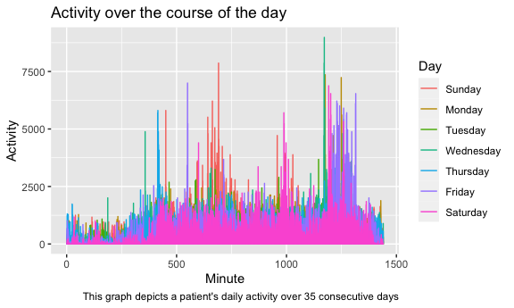

Data Science Homework 3
================
Caroline Andy
10/10/2020

## Problem 1

First I will load my required packages, including p8105.datasets, which
we will use for this problem. I will also set my figure preferences in
global options.

``` r
library(tidyverse)
library(p8105.datasets)

knitr::opts_chunk$set(
  fig.width = 6,
  fig.asp = 0.6,
  out.width = "90%"
)
```

Now I will load my data.

``` r
data("instacart")
```

Instacart is an online grocery service. In New York City, partner stores
include Whole Foods, Fairway, and The Food Emporium. The Instacart
Online Grocery Shopping Dataset 2017, used in this question, is an
anonymized dataset with over 3 million online grocery orders from more
than 200,000 Instacart users.

This dataset contains 1384617 rows and 15 columns. Observations are at
the level of items in orders by users. There are user/order variables –
user ID, order number, order ID, order day, and order hour. There are
also item variables – name, aisle, department, and some numeric codes.

How many aisles, and which are most items from?

``` r
instacart %>%
  count(aisle) %>%
  arrange(desc(n))
```

    ## # A tibble: 134 x 2
    ##    aisle                              n
    ##    <chr>                          <int>
    ##  1 fresh vegetables              150609
    ##  2 fresh fruits                  150473
    ##  3 packaged vegetables fruits     78493
    ##  4 yogurt                         55240
    ##  5 packaged cheese                41699
    ##  6 water seltzer sparkling water  36617
    ##  7 milk                           32644
    ##  8 chips pretzels                 31269
    ##  9 soy lactosefree                26240
    ## 10 bread                          23635
    ## # … with 124 more rows

Make a plot showing the number of items ordered in each isle. Only
include aisles with +10,000 items purchased.

``` r
instacart %>%
  count(aisle) %>%
  filter(n > 10000) %>%
  mutate(
    aisle = factor(aisle),
    aisle = fct_reorder(aisle, n)
  ) %>%
  ggplot(aes(x = aisle, y = n)) +
  geom_point() +
  theme(axis.text.x = element_text(angle = 90, vjust = 0.5, hjust = 1)) +
  labs(
    title = "Frequency of Items Ordered From Each Aisle",
    x = "Aisle",
    y = "Number of Purchased Items"
  )
```


Make a table containing three most population items in each of the
aisles “baking ingredients,” “dog food care,” and “packaged vegetable
fruits.” Include the number of times each item is ordered in your table.

First let’s pull out different aisles, then we will count up most
popular items within each aisle.

``` r
instacart %>%
  filter(aisle %in% c("baking ingredients", "dog food care", "packaged vegetables fruits")) %>%
  group_by(aisle) %>%
  count(product_name) %>%
  mutate(rank = min_rank(desc(n))) %>%
  filter(rank < 4) %>%
  arrange(aisle, rank) %>%
  #clean up table for Rmd
  knitr::kable()
```

| aisle                      | product\_name                                 |    n | rank |
| :------------------------- | :-------------------------------------------- | ---: | ---: |
| baking ingredients         | Light Brown Sugar                             |  499 |    1 |
| baking ingredients         | Pure Baking Soda                              |  387 |    2 |
| baking ingredients         | Cane Sugar                                    |  336 |    3 |
| dog food care              | Snack Sticks Chicken & Rice Recipe Dog Treats |   30 |    1 |
| dog food care              | Organix Chicken & Brown Rice Recipe           |   28 |    2 |
| dog food care              | Small Dog Biscuits                            |   26 |    3 |
| packaged vegetables fruits | Organic Baby Spinach                          | 9784 |    1 |
| packaged vegetables fruits | Organic Raspberries                           | 5546 |    2 |
| packaged vegetables fruits | Organic Blueberries                           | 4966 |    3 |

Make a table showing the mean hour of the day which Pink Lady Apples and
Coffee Ice Cream are ordered on each day of the week.

``` r
instacart %>%
  filter(product_name %in% c("Pink Lady Apples", "Coffee Ice Cream")) %>%
  group_by(product_name, order_dow) %>%
  summarize(mean_hour = mean(order_hour_of_day)) %>%
  pivot_wider(
    names_from = order_dow,
    values_from = mean_hour
  )
```

    ## `summarise()` regrouping output by 'product_name' (override with `.groups` argument)

    ## # A tibble: 2 x 8
    ## # Groups:   product_name [2]
    ##   product_name       `0`   `1`   `2`   `3`   `4`   `5`   `6`
    ##   <chr>            <dbl> <dbl> <dbl> <dbl> <dbl> <dbl> <dbl>
    ## 1 Coffee Ice Cream  13.8  14.3  15.4  15.3  15.2  12.3  13.8
    ## 2 Pink Lady Apples  13.4  11.4  11.7  14.2  11.6  12.8  11.9

## Problem 2

I will begin by loading, cleaning and tidying in the required dataset
for this problem. This problem uses five weeks of accelerometer data
collected on a 63 year-old male with BMI 25, who was admitted to the
Advanced Cardiac Care Center of Columbia University Medical Center and
diagnosed with congestive heart failure (CHF).

``` r
accel_data = read_csv("./accel_data.csv") %>%
  #clean variable names
  janitor::clean_names() %>%
  #change table formatting to longer
  pivot_longer(
    cols = starts_with("activity"),
    names_to = "minute", 
    names_prefix = "activity.",
    values_to = "activity") %>%
  #create day_type variable with weekday and weekend entries
  mutate(day_type = ifelse(day %in% c("Monday", "Tuesday", "Wednesday", "Thursday", "Friday"), "Weekday", "Weekend")) %>%
  #change variable types as appropriate
  mutate(minute = as.numeric(minute)) %>%
  #reorder variables
  select(day_id, day, week, day_type, minute, activity)
skimr::skim(accel_data)
```

|                                                  |             |
| :----------------------------------------------- | :---------- |
| Name                                             | accel\_data |
| Number of rows                                   | 50400       |
| Number of columns                                | 6           |
| \_\_\_\_\_\_\_\_\_\_\_\_\_\_\_\_\_\_\_\_\_\_\_   |             |
| Column type frequency:                           |             |
| character                                        | 2           |
| numeric                                          | 4           |
| \_\_\_\_\_\_\_\_\_\_\_\_\_\_\_\_\_\_\_\_\_\_\_\_ |             |
| Group variables                                  | None        |

Data summary

**Variable type: character**

| skim\_variable | n\_missing | complete\_rate | min | max | empty | n\_unique | whitespace |
| :------------- | ---------: | -------------: | --: | --: | ----: | --------: | ---------: |
| day            |          0 |              1 |   6 |   9 |     0 |         7 |          0 |
| day\_type      |          0 |              1 |   7 |   7 |     0 |         2 |          0 |

**Variable type: numeric**

| skim\_variable | n\_missing | complete\_rate |   mean |     sd | p0 |    p25 |   p50 |     p75 | p100 | hist  |
| :------------- | ---------: | -------------: | -----: | -----: | -: | -----: | ----: | ------: | ---: | :---- |
| day\_id        |          0 |              1 |  18.00 |  10.10 |  1 |   9.00 |  18.0 |   27.00 |   35 | ▇▇▇▇▇ |
| week           |          0 |              1 |   3.00 |   1.41 |  1 |   2.00 |   3.0 |    4.00 |    5 | ▇▇▇▇▇ |
| minute         |          0 |              1 | 720.50 | 415.70 |  1 | 360.75 | 720.5 | 1080.25 | 1440 | ▇▇▇▇▇ |
| activity       |          0 |              1 | 267.04 | 443.16 |  1 |   1.00 |  74.0 |  364.00 | 8982 | ▇▁▁▁▁ |

The generated plot contains 50400 rows and 6 columns. After cleaning the
data, remaining columns include a day identifier, day of the week, week
number, day type (weekday vs weekend), minute, and activity level. The
“skimr::skim()” code above allows us to assess variable types and
summary statistics for each. For the activity variable, the mean
activity level is 267 units. The maximum activity level reported at any
given minute is 8982 units.

Traditional analyses of accelerometer data focus on the total activity
over the day. I will now aggregate across minutes to create a total
activity variable for each day, and create a table showing these totals.

``` r
#create a summary dataset containing activity totals for each day and week
summ.accel = accel_data %>%
  group_by(day, week) %>%
  summarise(total = sum(activity))
summ.accel
```

    ## # A tibble: 35 x 3
    ## # Groups:   day [7]
    ##    day     week   total
    ##    <chr>  <dbl>   <dbl>
    ##  1 Friday     1 480543.
    ##  2 Friday     2 568839 
    ##  3 Friday     3 467420 
    ##  4 Friday     4 154049 
    ##  5 Friday     5 620860 
    ##  6 Monday     1  78828.
    ##  7 Monday     2 295431 
    ##  8 Monday     3 685910 
    ##  9 Monday     4 409450 
    ## 10 Monday     5 389080 
    ## # … with 25 more rows

We can investigate trends associated with activity level and day of the
week by grouping by day of the week and summarizing.

``` r
summ.day = summ.accel %>%
  group_by(day) %>%
  summarise(total = sum(total)) 
knitr::kable(summ.day)
```

| day       |   total |
| :-------- | ------: |
| Friday    | 2291711 |
| Monday    | 1858699 |
| Saturday  | 1369237 |
| Sunday    | 1919213 |
| Thursday  | 2091151 |
| Tuesday   | 1799238 |
| Wednesday | 2129772 |

We can investigate trends associated with activity level and week by
grouping by week and summarizing.

``` r
summ.week = summ.accel %>%
  group_by(week) %>%
  summarise(total = sum(total))
knitr::kable(summ.week)
```

| week |   total |
| ---: | ------: |
|    1 | 2569863 |
|    2 | 3231718 |
|    3 | 3224916 |
|    4 | 1919875 |
|    5 | 2512649 |

Immediately, we can see that activity levels tend to be highest on
Fridays and Wednesdays, and lowest on Saturdays and Tuesdays. We can
also see that activity levels were the highest in week 2 and the lowest
in week 4.

We can further visualize these results by generating a single-panel plot
that shows the 24-hr activity time courses for each day. I will do so
below, using color to indicate day of the week.

``` r
plot = accel_data %>%
  mutate(day = as.factor(day)) %>%
  mutate(day = factor(day, levels = str_c(c("Sunday", "Monday", "Tuesday", "Wednesday", "Thursday", "Friday", "Saturday")))) %>%
  ggplot(aes(x = minute, y = activity, color = day)) + 
  geom_line() +
  labs(
    title = "Activity over the course of the day",
      x = "Minute",
      y = "Activity",
      caption = "This graph depicts a patient's daily activity over 35 consecutive days") +
  guides(color = guide_legend("Day"))

plot
```



Based on the above graph, we can make several observations. Firstly, on
all days of the week, activity is low during the first \~300 minutes of
the day. Similarly, activity declines on all days of the week during the
last \~150 minutes of the day. This suggests that the patient is likely
sleeping during this timeframe. On Fridays,the patient sustains activity
longer into the night than on other weekdays.

On some days, the patient appears to be more active at different time
points. For example, the patient’s peak activity occurs on Tuesdays
around minute 1150, and on Sundays around minute 850.

## Problem 3

Next, I will load in the ny\_noaa from the p8105.datasets library.

The National Oceanic and Atmospheric Association (NOAA) of the National
Centers for Environmental Information (NCEI) provides public access to
some weather data, including the GHCN (Global Historical Climatology
Network)-Daily database of summary statistics from weather stations
around the world.

The ny\_noaa dataset contains 2,595,176 observations and 7 columns.
Noteworthy variables in the ny\_noaa dataset include: weather station
ID, date, maximum temperature (tenths of degrees C), minimum temperature
(tenths of degrees C), precipitation (tenths of mm), snowfall (mm), and
snow depth (mm). Each weather station may collect only a subset of these
variables, and therefore the resulting dataset contains extensive
missing data. 5.6% of the data are missing for the precipitation field;
14.7% of the data are missing for the snow fall field; 27.8% of the data
are complete for the snow depth field; 43.7% of the data are complete
for the temperature minimum and maximum fields.

I will begin by cleaning variable names; separating the date variable
into three variables denoting year, month, and day; changing variable
classes as necessary; and revaluing variable entries such that
temperature units are in degrees C and precipitation units are in mm.
Snowfall units are kept in mm.

``` r
library(p8105.datasets)
data("ny_noaa")

ny_noaa = 
  ny_noaa %>%
  janitor::clean_names() %>%
  separate(date, c("year", "month", "day")) %>%
  mutate(tmax = as.numeric(tmax),
         tmin = as.numeric(tmin),
         year = as.numeric(year),
         month = as.numeric(month),
         day = as.numeric(day)) %>%
  mutate(tmax = (tmax)/10,
         tmin = (tmin)/10,
         prcp = (prcp)/100)
```

For snowfall, what are the most commonly observed values? Why?

``` r
ny_noaa %>%
  group_by(snow) %>%
  count(snow, name = "n_obs") %>%
  arrange(desc(n_obs))
```

    ## # A tibble: 282 x 2
    ## # Groups:   snow [282]
    ##     snow   n_obs
    ##    <int>   <int>
    ##  1     0 2008508
    ##  2    NA  381221
    ##  3    25   31022
    ##  4    13   23095
    ##  5    51   18274
    ##  6    76   10173
    ##  7     8    9962
    ##  8     5    9748
    ##  9    38    9197
    ## 10     3    8790
    ## # … with 272 more rows

0 mm is the most commonly observed snowfall value. The most commonly
reported snowfall amount greater than 0 is 25 mm. This is consistent
with what we would expect, since most areas are not experiencing
snowfall more than they are experiencing snowfall. When snowfall does
occur, the average snowfall amount is faily low.

Next I will make a two-panel plot showing the average max temperature in
January and in July in each station across years.

``` r
data = filter(ny_noaa, month %in% c("1","7")) %>%
  group_by(year, month, id) %>%
  summarise(mean_tmax = mean(tmax, na.rm = TRUE))

ggplot(data = data, aes(x = year, y = mean_tmax, color = id)) +
  geom_line() +
  facet_grid(~ month) + 
  labs(
    title = "Average max temperatures in January and July",
    x = "Year",
    y = "Maximum temperature in degrees C") +
  theme(legend.position = "none") +
  theme(axis.text.x = element_text(angle = 270, vjust = 0.5, hjust = 1))
```


Both graphs have a zig-zag pattern denoting that the average temperature
maximum fluctuates between years. Between 1980 and 2010, there appears
to be a slight increase in average January temperature maximum overtime.
The average temperatures in July are more consistent overtime, and have
less fluctuation between temperature maximums over the observed years.
In the July temperature graph, one weather station appears to have
reported an abnormally low high value (\< 10 degrees Celsius) during the
late 1980s. In the January temperature graph, one weather station
appears to have reported an abnormally low high value (-13 degrees
Celsius).

As one would expect, the temperature highs in July are significantly
higher than the temperature highs in January.

Next I will make a two-panel plot showing (i) tmax vs tmin for the full
dataset; and (ii) the distribution of snowfall values greater than 0 and
less than 100 separately by year.

``` r
##generating first plot
hex = ggplot(ny_noaa, aes(x = tmax, y = tmin)) + 
  geom_hex() + 
  labs(
    title = "Density of Reported Temperature Max and Mins",
    x = "Max daily temp (C)",
    y = "Min daily temp (C)")

##generating second plot
snowfall_plot <- ny_noaa %>%
  filter((snow > 0) & (snow < 100)) %>%
  ggplot(aes(x = as.character(year), y = (snow))) +
  geom_boxplot() + 
  labs(
    title = "Distribution of Snowfall Values by Year ",
    x = "Year",
    y = "Snowfall (mm)")
  theme(axis.text.x = element_text(angle = 270, vjust = 0.5, hjust = 1))
```

    ## List of 1
    ##  $ axis.text.x:List of 11
    ##   ..$ family       : NULL
    ##   ..$ face         : NULL
    ##   ..$ colour       : NULL
    ##   ..$ size         : NULL
    ##   ..$ hjust        : num 1
    ##   ..$ vjust        : num 0.5
    ##   ..$ angle        : num 270
    ##   ..$ lineheight   : NULL
    ##   ..$ margin       : NULL
    ##   ..$ debug        : NULL
    ##   ..$ inherit.blank: logi FALSE
    ##   ..- attr(*, "class")= chr [1:2] "element_text" "element"
    ##  - attr(*, "class")= chr [1:2] "theme" "gg"
    ##  - attr(*, "complete")= logi FALSE
    ##  - attr(*, "validate")= logi TRUE

``` r
##creating a two-panel plot using patchwork 
library(patchwork)               
hex / snowfall_plot
```


The above graphs show several trends with regard to reported temperature
maximums and minimums overtime, and the distribution of reported
snowfall overtime. The density of reported temperature maximums and
minimums plot shows the frequency with which stations have reported
given pairs of temperature lows and highs. The most frequently reported
pairs of temperature highs and lows are: i) high temperature of 5
degrees Celsius and low temperature of 0 degrees Celsius, and ii) high
temperature of 25 degrees Celsius and low temperature of 15 degrees
Celsius. In addition, the diagonal shape of the hex plot suggests that
as daily temperature highs increase, temperature lows also increase.

The snowfall graph shows boxplots of snowfall distrubution by year.
Overall, the reported snowfall is fairly consistent overtime, as is
revealed through the relatively constant median, and IQRs across
boxplots. While the medians have remained consistent overtime at
approximately 25 millimeters, the 75th percentile of snowfall was
notably dipped during the years 1998, 2006, and 2010. Several outliers
are visible on the high end of snowfall distribution during these same
years.
